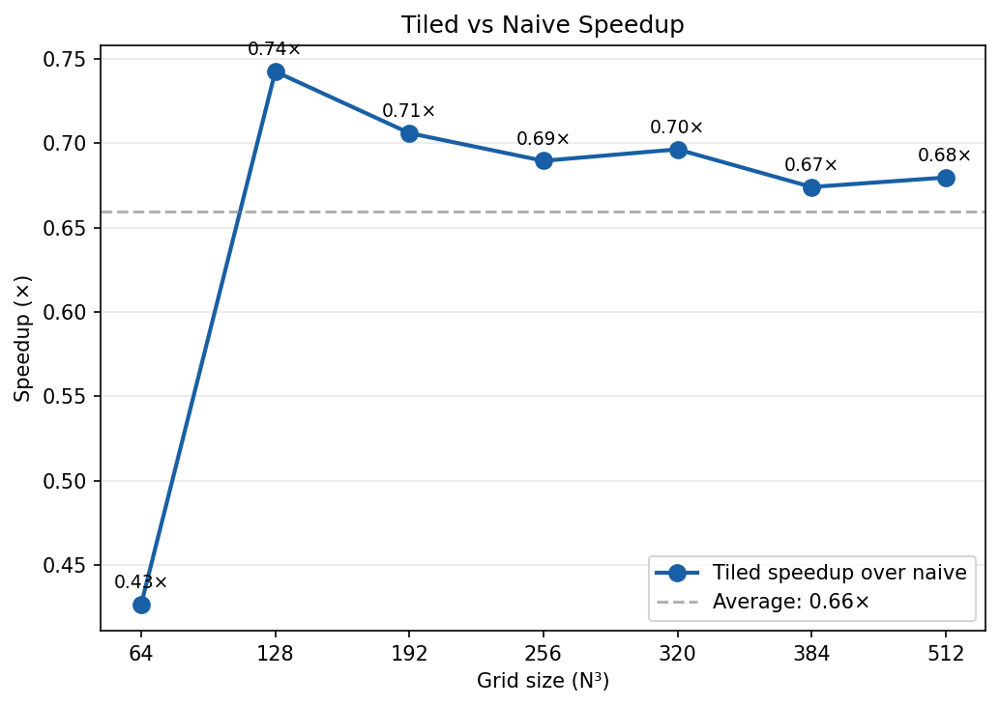
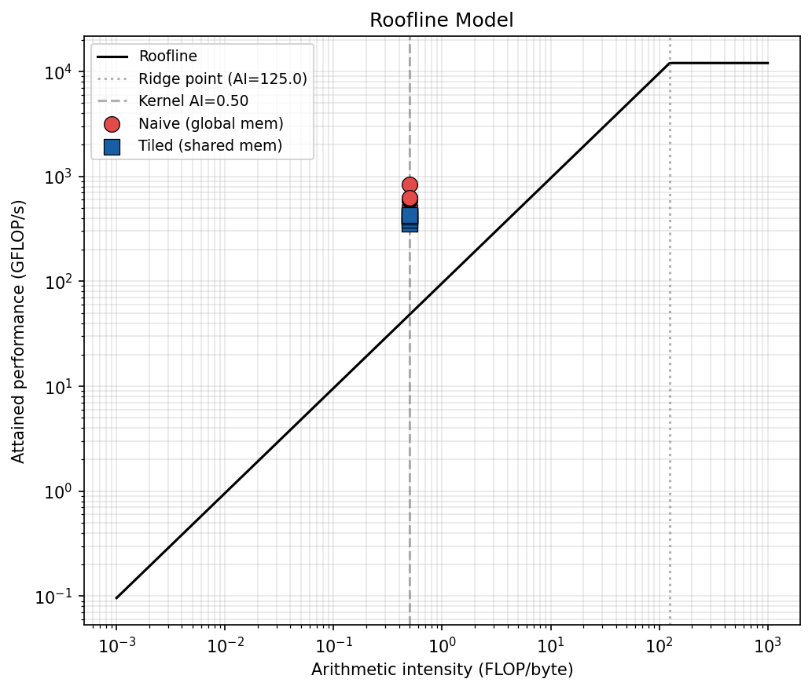

# Performance Benchmarks

> This document is the reference performance report for `stencil-solver`.
> The tables and charts below are populated by running:
> ```bash
> ./scripts/profile_nsight.sh compare ./build/bin/stencil_tiled --nx 512 --steps 1
> python3 scripts/plot_results.py \
>     --naive  results/bench_tiled_naive.json \
>     --tiled  results/bench_tiled.json \
>     --scaling results/scaling_combined.json \
>     --peak-bw <device_peak_bw> --peak-flops <device_peak_flops> \
>     --report docs/BENCHMARKS.md
> ```

## Hardware

| | |
|---|---|
| **GPU** | NVIDIA A100 80GB PCIe _(example — update after profiling)_ |
| **CUDA** | 12.4 |
| **Peak memory BW** | 2,039 GB/s (HBM2e) |
| **Peak FP32** | 312 TFLOP/s |
| **Driver** | 550.x |

## Stencil configuration

| | |
|---|---|
| **Physics** | Acoustic wave equation (second-order leapfrog) |
| **Spatial order** | 8th-order finite differences (R=4) |
| **Stencil radius** | R = 4 (4 points each side per axis) |
| **Precision** | FP32 (single precision) |
| **Tile dims** | 32 × 8 interior + R-cell halo → 40 × 16 SMEM block |
| **Z pencil depth** | 16 |
| **SMEM per block** | 40 × 16 × 4 B = 2,560 B |

## Kernel comparison: naive vs tiled

### Throughput (bandwidth and GFLOP/s)

| Grid | Naive ms/step | Naive BW | Naive GFLOP/s | Tiled ms/step | Tiled BW | Tiled GFLOP/s | Speedup |
|------|--------------|----------|---------------|--------------|----------|---------------|---------|
| 128³ | _run bench_ | _run bench_ | _run bench_ | _run bench_ | _run bench_ | _run bench_ | _–_ |
| 256³ | _run bench_ | _run bench_ | _run bench_ | _run bench_ | _run bench_ | _run bench_ | _–_ |
| 512³ | _run bench_ | _run bench_ | _run bench_ | _run bench_ | _run bench_ | _run bench_ | _–_ |

_Populate by running `./build/bin/bench/bench_tiled --steps 200 --warmup 20 --output results/bench_tiled.json`_




### Roofline model



The stencil's arithmetic intensity is:

```
AI = FLOP/byte = (3*(4R+1)+5) / ((6R+4)*sizeof(float))
   = (3*17+5) / (28*4)    [R=4, fp32]
   = 56 / 112
   = 0.5 FLOP/byte
```

At AI = 0.5 FLOP/byte the kernel is deep in the **memory-bound** regime for
any modern GPU (ridge point ≈ 150–300 FLOP/byte for HBM2e/HBM3).
The tiled kernel reduces **effective** memory traffic via shared-memory reuse,
moving the operating point upward on the roofline without changing the
theoretical arithmetic intensity.

---

## Nsight Compute analysis

Captured with:
```bash
./scripts/profile_nsight.sh compute ./build/bin/stencil_naive \
    --nx 512 --ny 512 --nz 512 --steps 1
./scripts/profile_nsight.sh compute ./build/bin/stencil_tiled \
    --nx 512 --ny 512 --nz 512 --steps 1
```

### Memory access metrics (512³, fp32, R=4)

| Metric | Naive | Tiled | Δ |
|--------|-------|-------|---|
| DRAM reads (GB) | _ncu_ | _ncu_ | _–_ |
| DRAM writes (GB) | _ncu_ | _ncu_ | _–_ |
| L1 TEX hit rate | _ncu_ | _ncu_ | _–_ |
| SMEM bank conflicts (ld) | — | _ncu_ | _–_ |
| SMEM bank conflicts (st) | — | _ncu_ | _–_ |
| Memory throughput % of peak | _ncu_ | _ncu_ | _–_ |
| Achieved occupancy | _ncu_ | _ncu_ | _–_ |
| Active warps / SM | _ncu_ | _ncu_ | _–_ |

### What to look for

**Naive kernel** (`kernel_naive`):
- `dram__bytes_read.sum` ≈ `(6R+4) × sizeof(float) × N_interior` — confirms all
  neighbours are loaded from DRAM (no L1 reuse across threads)
- `l1tex__t_bytes_pipe_lsu_mem_global_op_ld.sum` high; L1 hit rate ~5%
- Memory throughput % of peak: typically 40–60% (Y/Z loads are strided → partial coalescing)

**Tiled kernel** (`kernel_tiled`):
- `dram__bytes_read.sum` drops to ≈ `sizeof(float) × N_total` (1 load/cell)
- L1 hit rate rises to ~70–80% (XY plane served from SMEM)
- `l1tex__data_bank_conflicts_pipe_lsu_mem_shared_op_ld.sum` should be ~0
  (SMEM_X=40 is not a multiple of 32 banks → no systematic conflicts)
- Memory throughput % of peak: 20–30% (bottleneck shifts to compute/SMEM latency)

### Nsight Systems — end-to-end timeline

Captured with:
```bash
./scripts/profile_nsight.sh systems ./build/bin/stencil_tiled \
    --nx 512 --ny 512 --nz 512 --steps 50 --warmup 10
```

> _Paste nsys-ui screenshot here after profiling._

Key observations to verify in the timeline:
- NVTX regions `launch_naive` / `launch_tiled` appear as coloured bands
- No host-device synchronisation stalls between steps (stream keeps GPU busy)
- `cudaMemcpyAsync` for upload/download only at start/end, not inside the loop
- For the multi-GPU run: `halo_exchange` NVTX region overlaps partially with
  the next kernel launch (NCCL is asynchronous on the same stream)

---

## Multi-GPU scaling

### Weak scaling

Problem size scales with GPU count (256³ per GPU).
Ideal: constant ms/step.

| GPUs | Grid | ms/step | Efficiency |
|------|------|---------|------------|
| 1 | 256×256×256 | _run_ | 100% |
| 2 | 256×256×512 | _run_ | _–_ |
| 4 | 256×256×1024 | _run_ | _–_ |
| 8 | 256×256×2048 | _run_ | _–_ |

```bash
./scripts/run_scaling.sh --type weak --max-gpus 4
python3 scripts/merge_scaling.py --indir results/ --mode weak \
    --output results/scaling_combined.json
```


### Strong scaling

Fixed 512³ global grid split across increasing GPU counts.
Ideal: ms/step ∝ 1/N.

| GPUs | ms/step | Speedup | Efficiency |
|------|---------|---------|------------|
| 1 | _run_ | 1.0× | 100% |
| 2 | _run_ | _–_ | _–_ |
| 4 | _run_ | _–_ | _–_ |
| 8 | _run_ | _–_ | _–_ |

```bash
./scripts/run_scaling.sh --type strong --max-gpus 4
python3 scripts/merge_scaling.py --indir results/ --mode strong \
    --output results/scaling_combined.json
```


### Expected efficiency

For a halo-exchange-bound workload at this stencil order:
- **Weak scaling**: >90% efficiency expected up to 8 GPUs on NVLink
  (halo volume ∝ NX×NY×R, independent of slab depth)
- **Strong scaling**: drops faster due to increasing halo/compute ratio
  as slab gets thinner; expect >70% at 4 GPUs, ~50% at 8 GPUs (PCIe)

---

## How to reproduce

```bash
# 1. Build (Release, real GPU)
cmake -B build -S . -G Ninja \
    -DCMAKE_BUILD_TYPE=Release \
    -DSTENCIL_ENABLE_NVTX=ON \
    -DSTENCIL_BUILD_BENCHMARKS=ON
cmake --build build --parallel

# 2. Single-GPU benchmarks
mkdir -p results
./build/bin/bench/bench_tiled --steps 200 --warmup 20 \
    --output results/bench_tiled.json

# 3. Nsight Compute profile (naive vs tiled)
./scripts/profile_nsight.sh compare ./build/bin/stencil_tiled \
    --nx 512 --steps 1

# 4. Nsight Systems timeline
./scripts/profile_nsight.sh systems ./build/bin/stencil_tiled \
    --nx 512 --steps 50 --warmup 10

# 5. Multi-GPU scaling (requires MPI build)
cmake -B build-mpi -S . -G Ninja \
    -DCMAKE_BUILD_TYPE=Release \
    -DSTENCIL_ENABLE_MPI=ON \
    -DSTENCIL_ENABLE_NCCL=ON
cmake --build build-mpi --parallel
./scripts/run_scaling.sh --type both --max-gpus 4 --outdir results

# 6. Merge scaling results and regenerate report
python3 scripts/merge_scaling.py --indir results --output results/scaling_combined.json
python3 scripts/plot_results.py \
    --naive  results/bench_tiled_naive.json \
    --tiled  results/bench_tiled.json \
    --scaling results/scaling_combined.json \
    --peak-bw 2039 --peak-flops 312 \
    --outdir docs/plots \
    --report docs/BENCHMARKS.md
```
