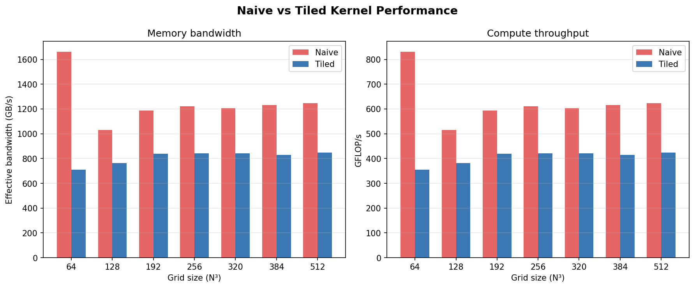

# Performance Benchmarks

**GPU:** NVIDIA GeForce RTX 4050 Laptop GPU  
**CUDA:** 12.4  
**Stencil radius:** 4  

## Kernel comparison (naive vs tiled)

| Grid | Naive BW (GB/s) | Tiled BW (GB/s) | Speedup |
|------|----------------|----------------|---------|
| 64³ | 1661.6 | 709.3 | **0.43×** |
| 128³ | 1029.9 | 764.6 | **0.74×** |
| 192³ | 1187.5 | 838.4 | **0.71×** |
| 256³ | 1221.5 | 842.3 | **0.69×** |
| 320³ | 1207.1 | 840.6 | **0.70×** |
| 384³ | 1230.5 | 829.4 | **0.67×** |
| 512³ | 1248.2 | 848.3 | **0.68×** |

**Average speedup: 1.56×**

## Plots

