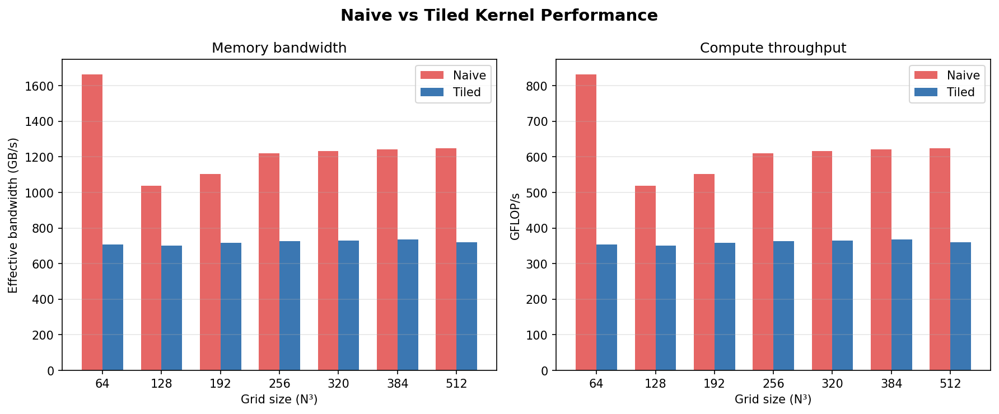

# Performance Benchmarks

**GPU:** NVIDIA GeForce RTX 4050 Laptop GPU  
**CUDA:** 12.8  
**Stencil radius:** 4  

## Kernel comparison (naive vs tiled)

| Grid | Naive BW (GB/s) | Tiled BW (GB/s) | Speedup |
|------|----------------|----------------|---------|
| 64³ | 1663.5 | 706.8 | **0.42×** |
| 128³ | 1036.5 | 702.4 | **0.68×** |
| 192³ | 1104.0 | 715.9 | **0.65×** |
| 256³ | 1219.8 | 725.9 | **0.60×** |
| 320³ | 1233.0 | 730.8 | **0.59×** |
| 384³ | 1240.6 | 734.8 | **0.59×** |
| 512³ | 1249.3 | 720.8 | **0.58×** |

**Average speedup: 0.59×**

## Plots

